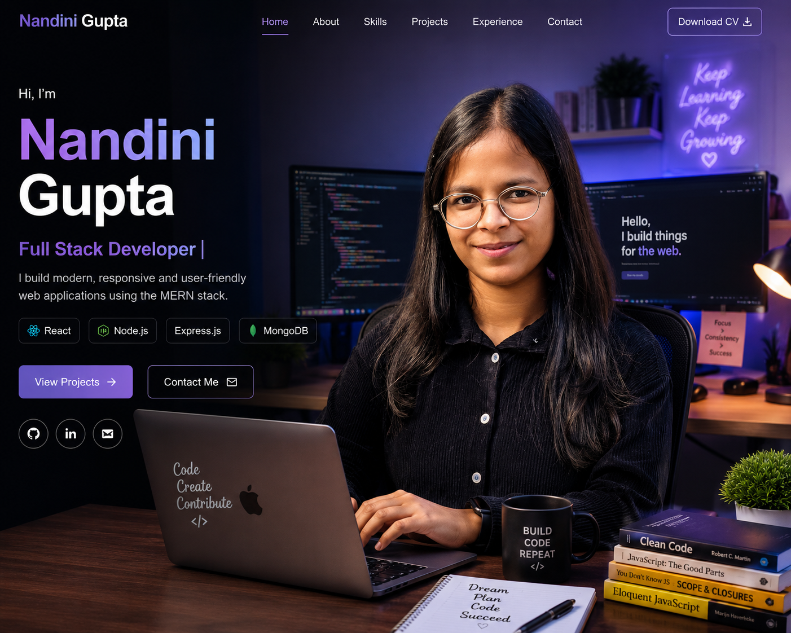

 # 🌐 Nandini Gupta | Portfolio

A modern, responsive personal portfolio website built with **React.js** to showcase my skills, projects, internships, achievements, and education. 

## 📸 Preview



---

## ✨ Features

- Responsive Design
- Modern UI/UX
- About Me Section
- Skills Showcase
- Experience Timeline
- Projects Gallery
- Achievements & Certifications
- Education
- Resume Download
- Contact Information

---

## 🛠️ Tech Stack

### Frontend

- React.js
- JavaScript (ES6+)
- HTML5
- CSS3
- Styled Components

### Tools

- Git
- GitHub
- VS Code

---

## 📂 Project Structure

```
src/
├── components/
├── data/
├── images/
├── themes/
├── App.js
└── index.js

public/
├── HeroImage.png
├── Nandini_Gupta_Resume.pdf
└── certificates/
```

---

## 📁 Featured Projects

- 📝 ExamNotes AI
- 🏫 CampusOrbit ERP
- 🏡 Wanderlust
- 📚 Book Store
- 🍽️ Zomato Clone

---

## 🎓 Education

**B.Tech Computer Science & Engineering**

Seth Jai Parkash Mukand Lal Institute of Engineering & Technology (JMIT), Radaur

Affiliated to Kurukshetra University

---

## 🏆 Achievements

- 🥇 1st Position – B.Tech CSE
- 🥈 2nd Position – B.Tech CSE
- Smart India Hackathon Participant
- Web Development Internship
- AI/ML Workshop

---

## 📄 Resume

Download Resume directly from the portfolio.

---

## 📬 Contact

📧 Email: **nandinigarg583@gmail.com**

💼 LinkedIn:
https://www.linkedin.com/in/nandini-gupta-11490b293

💻 GitHub:
https://github.com/Nandini-Gupta2004

---

## ⚙️ Installation

Clone the repository

```bash
git clone https://github.com/Nandini-Gupta2004/Portfolio.git
```

Go to the project folder

```bash
cd Portfolio
```

Install dependencies

```bash
npm install
```

Run locally

```bash
npm start
```

---

## 🤝 Contributing

Contributions, suggestions, and feedback are welcome.

---

## ⭐ Support

If you like this project, consider giving it a ⭐ on GitHub!

---

© 2026 Nandini Gupta. All Rights Reserved.
